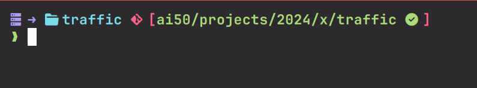
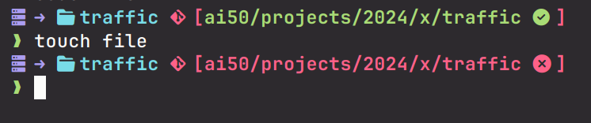
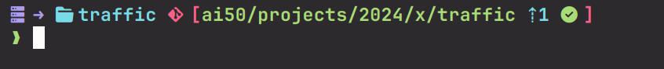

# 🎨 Custom Oh My Zsh Theme

### Clean repo


### Uncommitted changes


### Ahead of remote

## 📦 Installation

**Requirements:** A [Nerd Font](https://www.nerdfonts.com/) (FiraCode, JetBrains Mono, or Hack recommended)

```bash
# 1. Copy theme
cp nerd_prompt.zsh-theme ~/.oh-my-zsh/custom/themes/

# 2. Edit ~/.zshrc
ZSH_THEME="nerd_prompt"

# 3. Reload
source ~/.zshrc
```

## 🎨 Git Indicators

- `` = Clean | `` = Dirty
- `⇡2` = 2 ahead | `⇣3` = 3 behind | `⇕2/1` = Diverged
- **Green branch** = clean | **Red branch** = uncommitted changes

---
